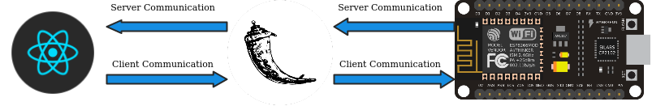
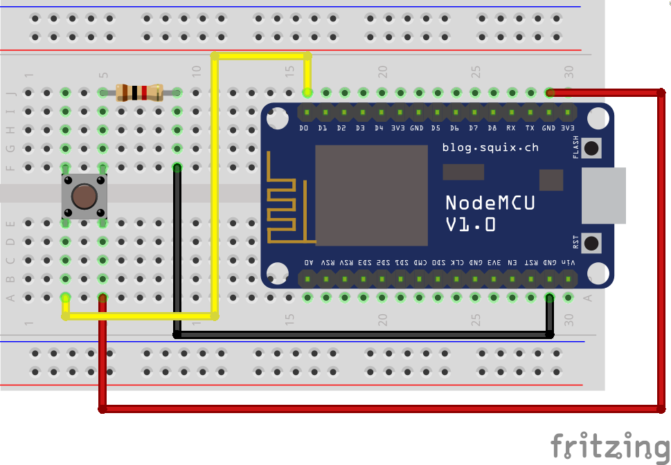

# Morse Client-Server with Socket
This repository presents 2 examples of client-server socket communications. The first example is a socket communication using a NodeMCU application as server and a python application as client. The second one, the python application acts is both client and server, client for socket communication with NodeMCU and server for an ReactJS appliaction.

## Project Archtecture


## Before running
For run this project you must:
1. Install NodeMCU libaries on Arduino IDE (if you use Arduino IDE)
1. Enter your wifi SSID and password values on NodeMCU code (`wifi_ssid` and `wifi_password`)
1. Debug the NodeMCU code into NodeMCU (Both examples)
1. Install `virtualenv` and then start it (Example two only)
1. Install `flask` and `flask_socketio` (Example two only)
5. REPLACE `HOST` variable on file `nodemcu_connection.py` with the wifi id of NodeMCU.


### Spinning up for example two
For running the example two, you will need to configure a few things. After clone this project run the following commands on project root folder:

```sh
# create a virtual environment on python client (for server spinning)
virtualenv python-client/venv
```

```sh
# install all dependencies for react app client
cd react-morse && npm install
```

## Running the project
1. Create the following circuit on a protoboard:

1. Using Arduino IDE, debug the code at `nodemcu-server/nodemcu-server.ino` on your NodeMCU.
1. Copy the given WiFi id (printed on Serial on 115200)
1. Replace `HOST` with NodeMCU WiFi Id (obtained from previous step)
1. For run the example one, run `python-client/nodemcu_connection.py` using:
```sh
python3 python-client/nodemcu_connection.py
```
1. For run the example two, make sure that your virtual environment is running. For run the virtual environment:
```sh
source python-client/venv/bin/activate
```
1. For run the ReactJS application:
```sh
cd react-morse && npm run start
```

## Enjoy!

## Morse code
Letter | Morse
---|---
A | .-
B | -...
C | -.-.
D | -..
E | .
F | ..-.
G | --.
H | ....
I | ..
J | .---
K | -.-
L | .-..
M | --
N | -.
O | ---
P | .--.
Q | --.-
R | .-.
S | ...
T | -
U | ..-
V | ...-
W | .--
X | -..-
Y | -.--
Z | --..
1 | .----
2 | ..---
3 | ...--
4 | ....-
5 | .....
6 | -....
7 | --...
8 | ---..
9 | ----.
0 | -----